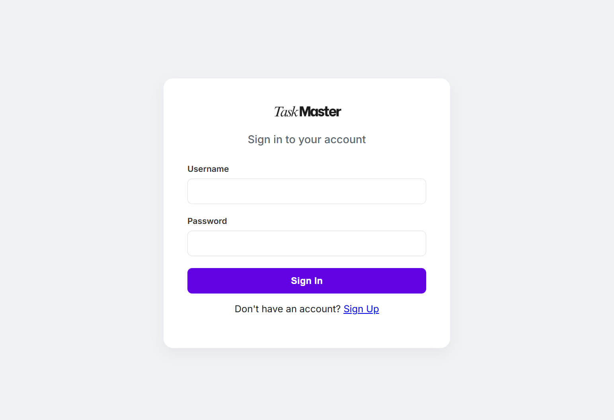
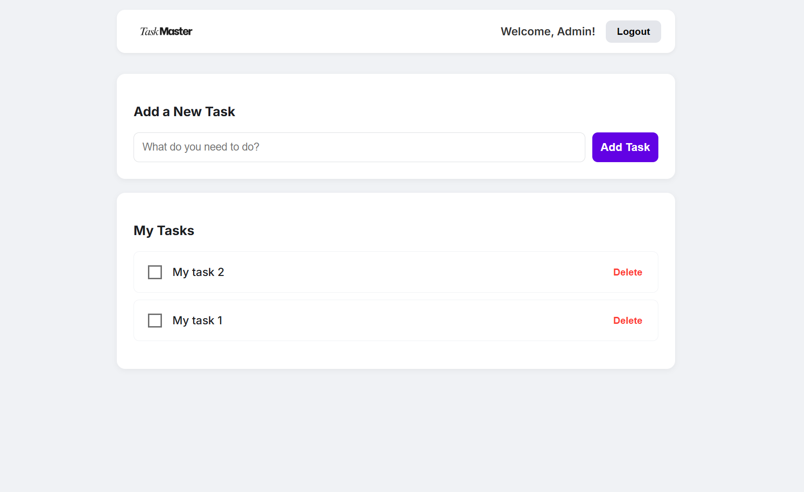

# 🚀 TaskMaster - Frontend

> A modern, secure, and responsive Task Management Single Page Application (SPA) built with Vanilla JavaScript.


### **🔴 Live Demo:**

👉 [TaskMaster](https://task-master-lite.netlify.app)

---

## 📖 Overview

TaskMaster is a full-stack application designed to help users organize their daily tasks securely.

This repository contains the **Frontend** of the application. It was built using **Pure HTML, CSS, and JavaScript** (No frameworks like React or Vue) to demonstrate a deep understanding of DOM manipulation, asynchronous programming, and RESTful API integration.

It connects to a secure Spring Boot Backend (deployed on Hugging Face) using **JWT (JSON Web Token)** authentication.

## 📸 Screenshots

|               Login Screen               |              User Dashboard               |
| :--------------------------------------: | :---------------------------------------: |
|  |  |

---

## ✨ Key Features

- **⚡ Single Page Application (SPA):** Seamless navigation between Login, Register, and Dashboard views without page reloads.
- **🔐 Secure Authentication:** Implements JWT storage in LocalStorage for persistent user sessions.
- **🎨 Modern UI/UX:** Custom CSS styling based on Figma designs, featuring a clean card layout and the Inter font family.
- **📝 Task Management:**
  - Create new tasks.
  - View personal task lists (User Data Isolation).
  - Mark tasks as completed (Visual Strikethrough).
  - Delete tasks with confirmation.
- **📱 Responsive:** Works on desktop and mobile devices.

---

## 🛠️ Tech Stack

- **Core:** HTML5, CSS3, JavaScript (ES6+)
- **Networking:** Fetch API (Async/Await)
- **Deployment:** Netlify (CI/CD Pipeline connected to GitHub)
- **Backend:** Java Spring Boot (Separate Repository)

---

## 🚀 How to Run Locally

If you want to run this frontend on your local machine:

1.  **Clone the repository:**

    ```bash
    git clone https://github.com/mihiranga-dev/taskflow-frontend.git
    ```

2.  **Open the project:**
    Navigate to the folder and simply open `index.html` in your browser.

    - _Tip: Use "Live Server" extension in VS Code for the best experience._

3.  **Configuration (Optional):**
    By default, the app connects to the live Cloud Backend. If you want to connect to your local Spring Boot server:
    - Open `app.js`.
    - Comment out the Production URL and uncomment the Local URL:
      ```javascript
      // const API_BASE_URL = "https://my-space.hf.space";
      const API_BASE_URL = "http://localhost:8080";
      ```

---

## 🔗 Related Repository

This frontend connects to the **TaskFlow Backend**.
👉 **[View Backend Repository](https://github.com/mihiranga-dev/taskflow-backend)**

---

## 👤 Author

**Mihiranga**

- [LinkedIn](https://www.linkedin.com/in/mihiranga-dev/)
- [GitHub](https://github.com/mihiranga-dev/)
